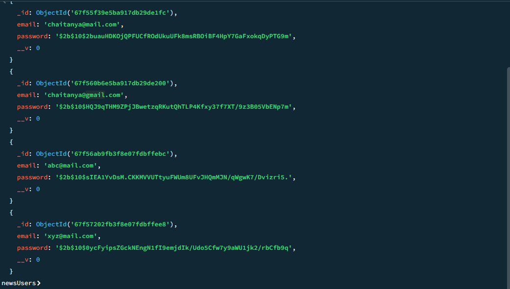

# Headlines Hub  

This project created using React js library and bootstrap framwork

## 📰 Headlines Hub — News App
Headlines Hub is a full-stack web application that delivers real-time news updates across various categories like business, sports, technology, and entertainment. Built using the MERN stack (MongoDB, Express.js, React, Node.js) and styled with Bootstrap, the app offers a clean and responsive user experience.

### 🔧 Tech Stack
Frontend: React.js + Bootstrap

Backend: Node.js + Express.js

Database: MongoDB (for user data, etc.)

News API: Custom Express API that fetches and filters live news data from public sources (or a 3rd-party API like NewsAPI)

### 🌟 Key Features
🗞️ Live News Feed: Fetches the latest headlines from multiple categories.

🔍 Search Functionality: Find articles by keywords or topics.

🎨 Responsive Design: Optimized for desktop and mobile using Bootstrap.

👤 User Login/Signup: Register and securely log in to personalize your news feed.

## Outputs 
## 📸 App Screenshots

| Page         | Screenshot |
|--------------|------------|
| 🏠 Home Page  | |
| 🔐 Login Page | |
| ✍️ Sign In Page ||
| 🙍‍♂️ Profile Page | |

## 🗃️ MongoDB Output

| Description                | Screenshot |
|---------------------------|------------|
| ✅ Console Output          |  |
| 📊 MongoDB Compass View   |  |

## node command to run webapp
### `npm start`
### `npm test`
### `npm run build`

