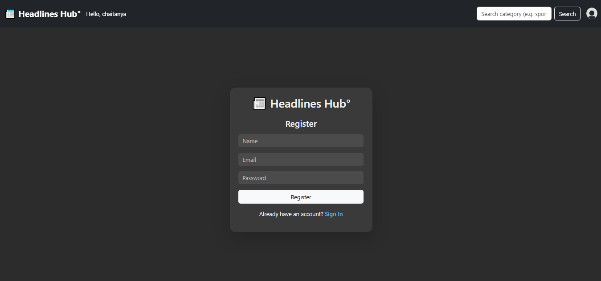

# Headlines Hub  

This project created using React js library and bootstrap framwork

## Outputs 

## 🚀 App Screenshots

## 📸 App Screenshots

| Page         | Screenshot |
|--------------|------------|
| 🠠Home Page  | |
| 🔠Login Page | |
| ✍️ Sign In Page ||
| 🙍‍♂️ Profile Page | |

## 🗃️ MongoDB Output

| Description                | Screenshot |
|---------------------------|------------|
| ✅ Console Output          |  |
| 📊 MongoDB Compass View   |  |

## node command to run webapp
### `npm start`
### `npm test`
### `npm run build`

